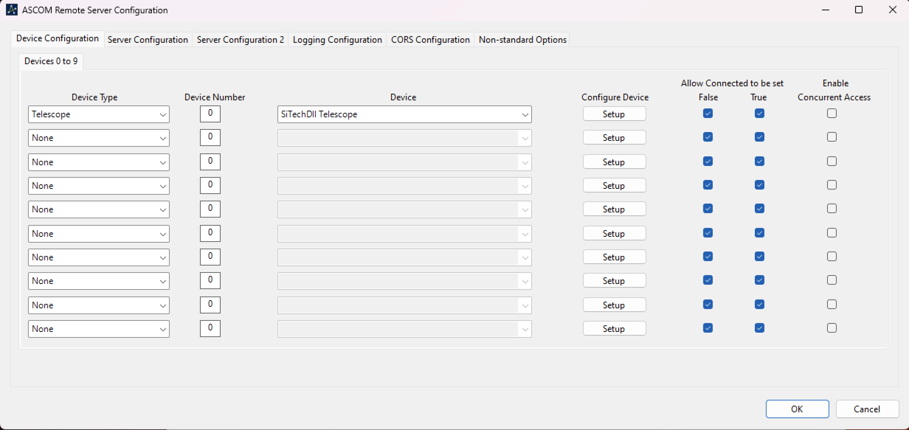
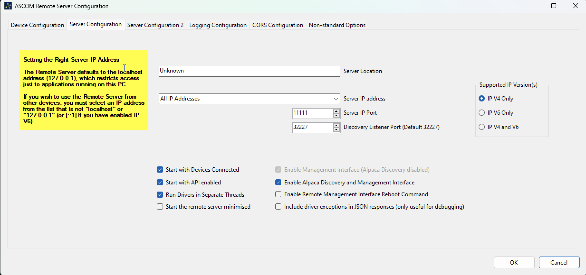

# f1-tcs

New MRO telescope control interface for the F1 controller

## How does the F1 controller works?

> [!WARNING]
> These are very preliminary notes and may contain significant errors or inaccuracies.

The F1 controller uses the [ASCOM](https://ascom-standards.org/index.htm) interface to serve its functionality over a standardised TCP/IP RESTful API. What this means is that the software provided with the F1 (technically the [SiTech](http://siderealtechnology.com/SiTechSetup095Z.exe) software) is a driver that does two things:

- Controls the mount/dome hardware in a way that is specific to the mount itself.
- Exposes a standardised interface to the hardware that can be used by any client that uses the ASCOM standard.

Notwithstanding the promises in the ASCOM page, ASCOM effectively can only work on Windows 10+ (Linux/maxOS may be possible with virtualisation, for example using [Mono](https://www.mono-project.com)).

### Running the ASCOM server with the F1 controller

The F1 controller provides a driver for Windows (maybe 10, but certainly works with 11). Here is how to get it to work on a fresh install of Windows 11:

1. Install ASCOM Alpaca from [here](https://ascom-standards.org/Downloads/Index.htm).
2. Install the SiTech software from the link above. This will install .NET if it is not present in the system.
3. It seems to be necessary to install the [FTD3XX](https://ftdichip.com/drivers/d3xx-drivers/) drivers for the FTDI chip. This provides the USB to COM interface that the SiTech software uses to communicate with the F1 controller.
4. After this one should be able to open the Brushless Servo Config app and connect to the F1 on the appropriate COM port and retrieve the current device configuration.
5. Open the ASCOM Remote Server. This app starts the TCP server that provides the ASCOM interface to the F1 controller. Click on `Setup`. In `Device Configuration` we add a telescope with device `SciTechDII Telescope`. Click on `Setup` and confirm that there a window pops up with a copyright to SciTech and Dan Gray.

    

6. In `Server Configuration` choose `All IP Addresses` to allow requests to the server from other IPs in the network (the default only allows requests from the same machine).

    

7. Click on `OK` and then exit and launch the app again. Now the SciTech GUI should open at the same time as the ASCOM Remote Server.

With the server running, and from other machine, we can query the telescope. This works even if the F1 is not connected to anything, or even if the F1 is not connected to the computer (obviously it will just return senseless values). For example, we can use `curl` to see if the telescope is connected:

```bash
$ curl -L "http://172.16.175.132:11111/api/v1/telescope/0/connected"
{"Value":true,"ClientTransactionID":0,"ServerTransactionID":7,"ErrorNumber":0,"ErrorMessage":""}
```

Or we can get the declination of the telescope:

```bash
$ curl -L "http://172.16.175.132:11111/api/v1/telescope/0/declination"
{"Value":44.11960194578386,"ClientTransactionID":0,"ServerTransactionID":4,"ErrorNumber":0,"ErrorMessage":""}
```

The full API specification is documented [here](https://ascom-standards.org/api/).

## Next steps

- [ ] Define the technology for the new telescope UI. This can be easily a webapp (it does not even need a backend since the ASCOM server is already an HTTP server from which the webapp client can fetch directly) but could also be an Electron or [Tauri](https://v2.tauri.app) app (Rust!) Evora does not explicitly need the telescope UI to access the telescope information since it can directly fetch from the ASCOM server.
- [ ] Determine how to run the ASCOM+SiTech server. We probably want a dedicated computer for this, which doesn't need to be too powerful. Ideally we want this to be a headless computer that simply run the server when it boots up, but it can also be a full computer (this has the advantage that we can also use the SiTech GUI as a backup). We could run Windows natively (with some configuration to launch the server on boot up) or run Linux and try to run the server in [Mono](https://www.mono-project.com). In the latter case we could bundle everything in a Docker image ([here](https://github.com/sdss/lvmpwi/blob/0.0.39/container/Dockerfile) is an example for a different mount with the same approach).
- [ ] Determine what features exposed by the ASCOM standard we want to display in the new telescope UI. Are there any features that we need that we cannot directly access via ASCOM?
- [ ] Choose a name for the new UI.

## More notes

- Proposal for how to [run the ASCOM server on Windows without virtualisation](SetupOnWindows.md).
- ASCOM has some [simulators](https://github.com/ASCOMInitiative/ASCOM.Alpaca.Simulators) that can be used for development instead of using the real SiTech software. It can be run on non-Windows systems via Docker. Note on how to set up the simulators [here](UsingASCOMSimulator.md).
