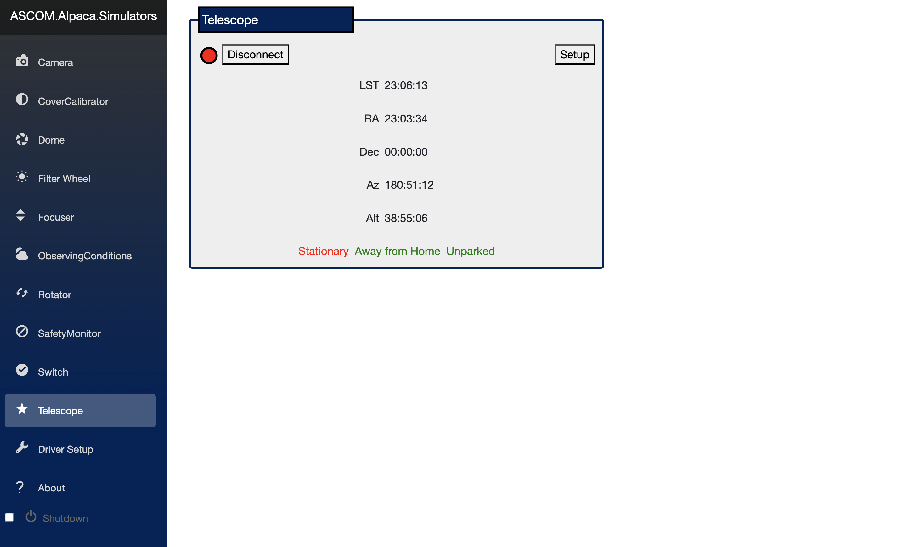
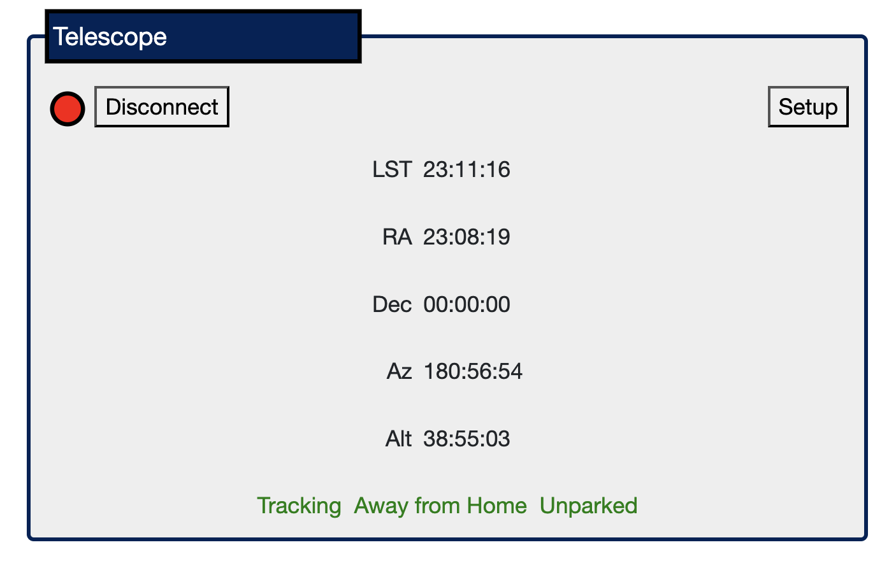

# Using the ASCOM Simulators

ASCOM provides a set of simulators that can be used to test the ASCOM server without the need of the real SiTech software. The simulators are available [here](https://github.com/ASCOMInitiative/ASCOM.Alpaca.Simulators) and can be run over Docker. Because the goal of the ASCOM platform is to provide a standardised interface to astronomical hardware, we can develop an UI that works with the simulator and then use it with the real F1 hardware with few changes (but note that the F1 does not implement the entire API).

> **Note to OSX users**: the simulator repository is designed to run on Windows machines, including the default `docker-compose`. See [Running on Mac OSX](#running-on-mac-osx-arm) below for info on how to run on Mac (as of 03/06/25).

To run the simulators with Docker, first [install Docker](https://docs.docker.com/engine/install/) in your system.

The clone the repository:

```bash
$ git clone git@github.com:ASCOMInitiative/ASCOM.Alpaca.Simulators.git
Cloning into 'ASCOM.Alpaca.Simulators'...
remote: Enumerating objects: 5528, done.
remote: Counting objects: 100% (1696/1696), done.
remote: Compressing objects: 100% (413/413), done.
remote: Total 5528 (delta 1333), reused 1613 (delta 1280), pack-reused 3832 (from 1)
Receiving objects: 100% (5528/5528), 1.69 MiB | 4.53 MiB/s, done.
Resolving deltas: 100% (4196/4196), done.
```

Install [docker-compose](https://docs.docker.com/compose/). With the Docker engine running do

```bash
docker-compose up
```

This will create a new image from the `Dockerfile` if it does not exists (this may take a while) and then run the ASCOM platform and a web UI in port 80 (the exposed port can be changed in the `docker-compose.yml` file). You can access the web UI on [http://localhost:80](http://localhost:80).

Now go to the telescope tab and connect the device. This simulates connecting a real hardware mount to the ASCOM server.



We can now set a parameter in the telescope and see how the simulator accepts it. For example, we can enable tracking:

```bash
$ curl -X PUT -F "Tracking=true" "http://127.0.0.1:80/api/v1/telescope/0/tracking"
{"ClientTransactionID":0,"ServerTransactionID":14,"ErrorNumber":0,"ErrorMessage":""}
```

```bash
$ curl -X GET "http://127.0.0.1:80/api/v1/telescope/0/tracking"
{"Value":true,"ClientTransactionID":0,"ServerTransactionID":15,"ErrorNumber":0,"ErrorMessage":""}
```



You can also play with the API using the Swagger interface exposed at [http://localhost:80/swagger](http://localhost:80/swagger).


## Running on Mac OSX (ARM)

Version 4 doesn't yet work on Mac OSX - see [ASCOM.Alpaca.Simulators/issues/18](https://github.com/ASCOMInitiative/ASCOM.Alpaca.Simulators/issues/18). Instead, to run the simulator on a Mac M-series computer (as of 03/06/2025):

1. Download the [version 3 x86_64 OSX release](https://github.com/ASCOMInitiative/ASCOM.Alpaca.Simulators/releases/download/v0.3.1/ascom.alpaca.simulators.macos-x64.zip) of the simulator.
2. Unzip it and and navigate to the new folder.
3. Run `sudo ./ascom.alpaca.simulators`

You'll get a web browser pointing to `localhost:32323` with the simulator running (José's instructions use `:80` traditionally, if someone finds an easy way to change this update these instructions).
